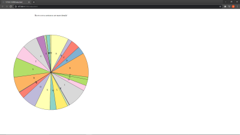
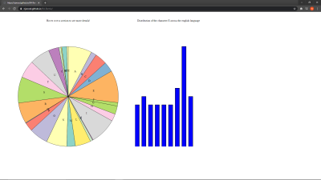

Assignment 4 - DataVis Remix + Multiple Views
===

The primary aim of this assignment is to showcase your **individual** skills at critiquing, redesigning, and extending visualizations on the web.

### Your Task

Your task is to choose a visualization, remix it, and add at least two linked-views.

By remix, we mean:

- Critique the original vis
- Redesign some aspect of it, using better task abstractions, encodings, etc.
- Implement your redesign

Examples of remixes include:
- taking a static choropleth map with a bad color scale, implementing a new version in d3, adding interactivity, and improving the color scale to show the original data in a more effective way
- finding a poorly designed or hard-to-use interactive visualization, and making a new version with better interaction design, such as features that enable the user to explore the data in new ways, by adding new views

By two linked views, we mean:

- Have two separate visualizations (likely separate SVGs), that visualize data using different idioms
- Linked views means that interacting in one updates the other, and vice versa. Think about the interaction flow that leads to good user experience and aligns with tasks you've identified.

Examples of linked views include:
- A large central map or scatterplot, with ancillary histograms that can be used to filter-- perhaps time or other dimensions

**Remember: the intent of this assignment is for you to demonstrate your understanding of the theory (e.g. concepts from Munzner's book) and practice (d3, and any tools you use for exploring the data) of visualization.**

Incorporating a brief writeup with your remix is a good idea.
Communicate what the original vis was, what the major issues were, and what new things can be seen with your redesign.
You could have text directly on the page, an "info" button, an about page, etc.

### More on Two Linked Views 
One of the most powerful techniques for mitigating the shortcomings of a given visualization is to link it with other views.

Linking a map to a bar or scatterplot, for instance, may allow you to overcome the shortcomings of a map.

In general, linking visualizations allows you to explore different parts of the data between views, and mitigates the shortcomings of a given view by pairing it with other views.

For this assignment, we want to see at least two linked views, in that interactions in one view updates the other, and vice versa. Many multiple views visualizations use more than two views, so consider such directions as possibilities for tech/design achievements. Be sure to think about what views work best for given tasks, and try to iterate/prototype if possible.

Requirements
---

0. Your code should be forked from the GitHub repo and linked using GitHub pages.
1. Your project should load a dataset you found on the web from the vis you're remixing. You may extract the data by sight if necessary. Put this file in your repo.
2. Your project should use d3 to build a visualization of the dataset. 
3. Your writeup (readme.md in the repo) should contain the following:

- Working link to the visualization hosted on gh-pages or other external sources.
- Concise description and screenshot of your visualization.
- Description of the technical achievements you attempted with this visualization.
- Description of the design achievements you attempted with this visualization.

Extra Links
---

- https://observablehq.com/@philippkoytek/d3-part-3-brushing-and-linking
- https://bl.ocks.org/john-guerra/raw/2c00b2d675a6bf1c84a7b140f4536b0d/
- https://github.com/d3/d3-brush
- https://observablehq.com/collection/@d3/d3-brush
- https://observablehq.com/@d3/focus-context?collection=@d3/d3-brush

# Writeup

Link to project [here](https://njwood.github.io/04-Remix/)

The vis I picked was something that I saw on r/dataisbeautiful. I dont think the data was displayed in the best way possible as it was Letter with a large percentage at the top. That was the main problem that I had with this visualization. The other portions were okay, and difficult to find ways to implement them into this project in a different way so I recreated the bar charts based on data visibility since it was hard to find actual data or csv's that contained this information. 

We can see that the original visualization was simple but also lacking in some areas, paticularly with each specific letter. 

The major change that I made to this visualization was a changing the data into a Pie Chart that can be seen here. I think the change to a pie chart gives a visual way to see the differences between the letters (some even very very hard to see on the chart). With the divides in the chart it shows the scale of what letters are used a lot more in the English Language compared to others. 

The link I had added to this was that when you hover over a certain portion of the chart, a bar chart representing the distribution of where the letter falls in words will render on its right. When hovering over another part, it will rerender with the graph of that corresponding letter 

I think that this visualization was difficult to come up with a creative way to do a lot of things since the only actual "data" was given by the percentages and for the bar charts I had to eyeball the data based on the legend that was displayed. 

The design achievement that I had was just the colorscheme of the pie chart as it alters based on the value that the character has. 
The technical achievement that I have is the dynamic rendering of the bar chart when you hover over a corresponding letter.
